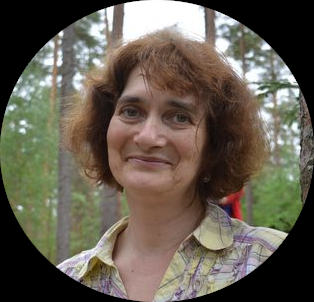

## Name: 
Irina Pika



## Connection: 
irinapika@gmail.com, irina-pika#2934 (discord)

## About: 
I want to learn new skills, update my knowledge and change the style pf my work. I want to learn how to work in a team. And I want to change my job. 

## Skills: 
I am an php-developer, I create and support web-sites. I use as base SMS of Bitrix and Webasist. 

## Code prime: 
``` 
  for (let i=0; i< colors.length; i++) {
    let l=colors[i].toLowerCase();  
 	  let ar=Math.max(letter[l.slice(1,3)], letter[l.slice(3,5)], letter[l.slice(5)]);
    if(ar > valmax) 
      {
      indexmax=i; 
      valmax=ar; 
      }
    }
 ```

## Experience:
Here are a few sites that I created and maintain now: https://ikamin.ru, https://skigu.ru, https://azbuka-interior.ru/

## Education: 
Main education: Novosibirsk State University, department of Mathematics. Also I completed in the Bitrix and HTML Academy several  courses.

## English level: 
I know several thousand words and can read the books and text, but my grammar is worse. My sadness, I cannot speak : ((  
Intermediate level. 


