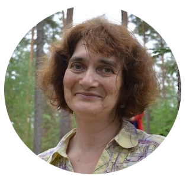

## Name: 
Irina Pika



## Connection: 
irinapika@gmail.com, irina-pika#2934 (discord)

## About: 
I wish get new skills, upgrade my knowleges and change style my work. I want to learn how work in command. And I want change my work. 

## Photo:  
see irinapika.jpg in this branch

## Skills: 
I am an php-developer, I create and support web-site. I use as base Bitrix and Webasist SMS. 

## Code prime: 
``` 
  for (let i=0; i< colors.length; i++) {
    let l=colors[i].toLowerCase();  
 	  let ar=Math.max(letter[l.slice(1,3)], letter[l.slice(3,5)], letter[l.slice(5)]);
    if(ar > valmax) 
      {
      indexmax=i; 
      valmax=ar; 
      }
    }
 ```

## Experience. 
There are some of sites, that I create and support now: https://ikamin.ru, https://skigu.ru, https://azbuka-interior.ru/ 

## Education: 
Novosibirsk State University, Mathematical department.  I have some courses from Bitrix and html-academy .

## English level: 
I know some thousand words and can read the books and text, but my gramma is worse. My sadness, I cannot speak : ((  
Intermediate level. 


